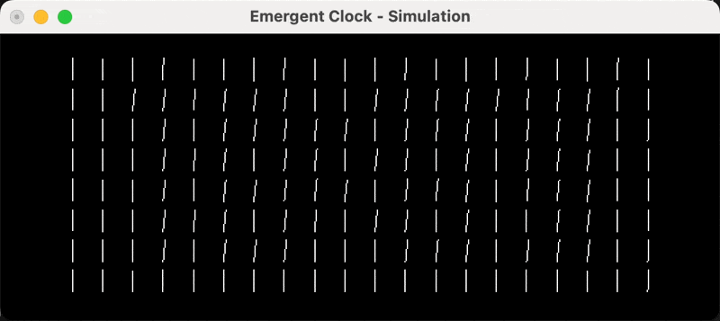

# Emergent Clock #

This clock consists of numerous clock hands in a grid.

These hands coordinate their rotation to depict emergent patterns and a display of the time.

### Simulation Guide ###

The purpose of this simulation is to fast-track prototyping of different clock designs.

To start, enter the simulation directory: `cd Simulation`.

From here you can run the previous simulation build with `./simulation`.

Simulation parameters can be edited in the `simulation.c` file.

To compile and run the edited simulation, run `gcc -o simulation simulation.c -framework OpenGL -framework GLUT -Wno-deprecated; ./simulation`
